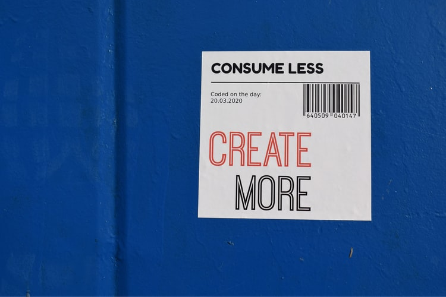
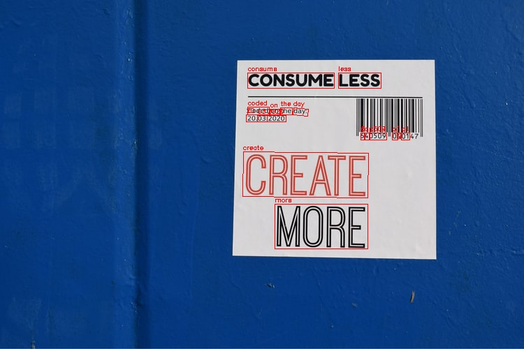

***
# Image Annotation

A web app for annotating the text in images using state-of-the-art ML models.

This project is an attempt to combine Clova AI's implementations of text spotting (CRAFT: [Github](https://github.com/clovaai/CRAFT-pytorch), [Paper](https://arxiv.org/pdf/1904.01941.pdf)) and the best performing model in their text recognition benchmark (TPS-Resnet-BiLSTM-Attn: [Github](https://github.com/clovaai/deep-text-recognition-benchmark), [Paper](https://arxiv.org/abs/1904.01906)) in one simple web app that showcases an end-to-end implementation of the two. The models are both pretrained, using classes from the linked Github repos so the majority of code is taken from there and simplified down.

***
### How to install

Install necessary packages

` $ pip install -r requirements.txt `

And run with 

` $ python app.py `

The server should go up on `localhost:5000`

***
### Usage

Simply open the app on `localhost:5000` and browse to your image file. Click 'Submit' and after a few seconds your image should appear with annotations. All images are saved in `static/output/`

Before:

After:

